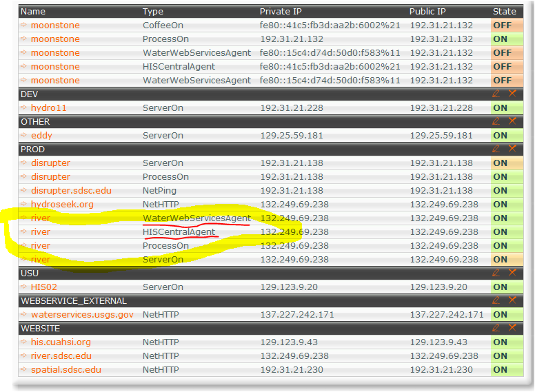
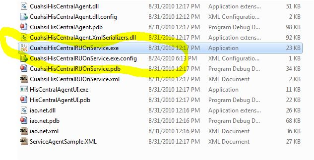
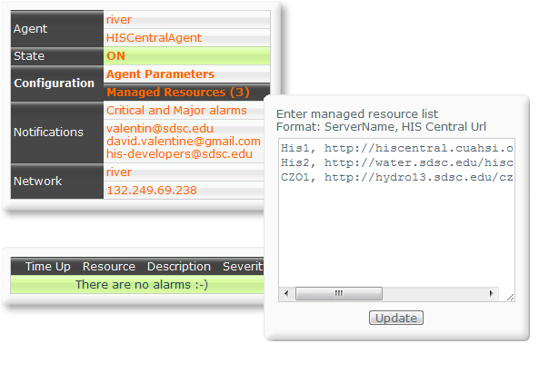
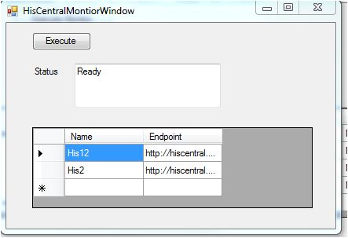
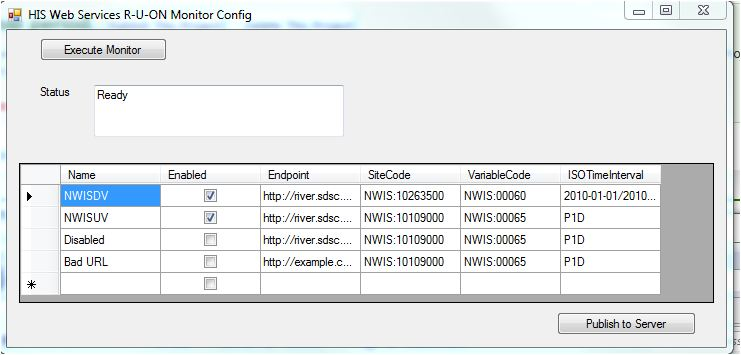
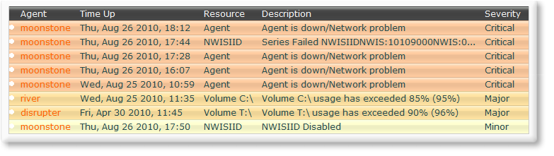

At present there are two monitoring projects that utilize the [R-U-ON.com](R-U-ON.com) online monitoring:
* HIS Central Monitoring
* HIS Web Services Monitoring

Ask for an account on r-u-on.com (From Dave V, or Yoori)

# His Central Monitoring
## Installing
* Download from downloads page
* expand zip file to a location (we suggest c:\r-u-on-monitors\HisCentral)
* right click on CuahsiHisCentralRUOnService.exe> RunAs Administrator

* Log onto [R-U-On.com](R-U-On.com) and there should be a new monitor

## Editing and adding
* you can easily to the two ways, the web site, and an application

* Application: click HisCentralAgentUI.exe

# HIS Web Services Monitoring
## Installing
* Download from download page
* expand zip file to a location (we suggest c:\r-u-on-monitors\HisWebServices)
* right click on CuahsiHisWebServicesRUOnService.exe> RunAs Administrator 

* Log onto [R-U-On.com](R-U-On.com) and there should be a new monitor
* add you name to the monitor

## Editing and adding
* The application is the suggested method.
* Application: click WaterWebServicesAgentUi.exe
* **Noted Bug: Always uploaded as Endabled. Edit in web to disable** 

# Using R-U-On.com
## Add your name

## Alerts

## add a resource
# Quirks:
* you may need to remove some regedit keys
